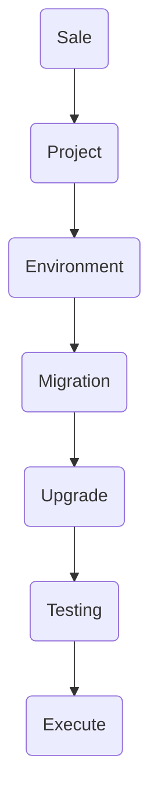

Als Odoo Partner sind wir mit Odoo 13.0 gestartet. In Software-Jahren ist das schon eine Weile her. Jedes Jahr veröffentlicht Odoo S.A. einen neuen Major-Release. Aktuell ist das Odoo 18.0. Damit man auf die Odoo Version wechseln kann, muss man ein Odoo Upgrade machen.

Upgrades von ERP-Systemen sind berühmt berüchtigt schief zu laufen. Anekdoten und Erzählungen von schief gelaufenen Upgrades gibt es noch und noch. Das liegt sicher auch daran, dass man über erfolgreiche Upgrades nicht spricht.
### Was ist ein Odoo Upgrade?

Mit jedem Odoo-Release wird auch der [Odoo Upgrade Service](https://upgrade.odoo.com/) aktualisiert. Odoo Enterprise Kunden dort ihre Datenbank hochladen und erhalten die Datenbank in einer neuen Version zurück. Leider ist das aber schon alles. Der Upgrade Service von Odoo kümmert sich nicht um:

* Datenmodelle von Dritten
* Migration der Module
* Anpassungen von Odoo Studio
* Umgang mit dem Filestore

Mit dem Upgrade Service von Odoo ist ein Odoo Upgrade noch nicht gemacht. Es braucht ein effizienten Prozess um alles vor und  nach dem Upgrade Service zu koordinieren.

Wir haben uns seit Version 13.0 auf 18.0 "durch-migriert". Dabei haben wir unsere Prozesse und Anleitungen stets aktualisiert und verbessert. Diese Erfahrung möchten wir hier teilen.

Machen wir aber noch einen Schritt zurück. Warum sollten man überhaupt ein Upgrade machen, wenn es doch nur Aufwand bedeutet?
## Warum ein Upgrade machen?

Die Situation mit Software Upgrades sieht oft wie folgt aus:

1. Kunde möchte das ERP-System auf eine neue Version upgraden
2. ERP-Partner startet das Upgrade-Projekt
3. Das Upgrade-Projekt dauer länger als erwartet
4. Die Kosten für ein Upgrade steigen
5. Das Upgrade-Projekt wird abgebrochen
6. Kunde bleibt auf alter Version des ERP-Systems
7. Kunde trägt Risiko für Sicherheitslücken im System
8. Das Risiko wird nicht mehr tragbar und Kunde beginnt wieder bei Punkt 1

Diesen Zyklus versucht Odoo zu brechen und verfolgt gute Ansätze wie man Kosten senken kann:

* Analyse der Anpassungen und Module von Dritten
* Odoo Community bietet Standard und Werkzeuge zur Entwicklung und Migration der Module
* Technische Integration des Odoo Upgrade Service

Nebst den steigenden technischen Schulden, die man durch die Nicht-Durchführung von Upgrades aufbaut, gibt es gute Gründe warum man ein Upgrade machen sollte:

* Nutzung neuer Odoo Features
* Stetige Verbesserung der Performance
* Nähe zum Odoo-Standard
* Schliessung von Sicherheitslücken

## Wie sieht ein Upgrade-Projekt aus?

Das Ergebnis eines Upgrade-Projekt ist ein Drehbuch. Im Drehbuch wird fesgehalten welche Schritte durchgeführt werden müssen um ein Odoo Upgrade für einen Kunden durchzuführen.

Damit man das Drehbuch ausführen kann, braucht es noch Vorbereitung. Diese Grafik zeigt die Prozesse zur Vorbereitung eines Odoo Upgrades:

**Sale**

Wir analysieren die bestehende Odoo-Datenbank und machen eine Aufwandsschätzung anhand verschiedener Faktoren (Anzahl Snippets, Module, Versionssprünge, ...)

**Project**

Wenn das Upgrade-Angebote angenommen wurde, initialisieren wir ein Upgrade-Projekt. Der Projektverantwortliche übernimmt die Koordination des Upgrades. Es wird definiert welche Module auf die neue Version migriert werden.

**Environment**

Eine neue Odoo-Installation wir in der Umgebung des kunden bereitgestellt. Diese wird zu einem späteren Zeitpunkt für das Testing verwendet. 

**Migration**

Entwickler migrieren die Odoo-Module und stellen diese in der neuen Umgebung bereit.

**Upgrade**

Entwickler führen das Upgrade der Datenbank durch und stellen diese in der Upgrade-Umgebung des Kunden für das Testing bereit.

**Testing**

Der Projektverantwortliche testen mit Kunden die Workflows in der aktualisierten Datenbank. Das Feedback geht zurück an die Entwickler und bei Bedarf werden Support-Tickets bei Odoo S.A. oder bei Dritten eröffnet.

Das Drehbuch für das Odoo Upgrade wird laufend aktualisiert. Wenn das Upgrade fehlerfrei durchgeführt und getestet werden konnte, erfolgt eine Freigabe durch den Kunden.

**Execute**

Für unerwartete Fehler wird eine Rollback-Szenario mit dem Kunden definiert. Das produktive Upgrade wird gemäss Drehbuch am vereinbarten Termin durchgeführt.

## Was ist beim Upgrade-Prozess wichtig?

Mit der gemeinsamen Entwicklung des Drehbuchs gewinnen Kunden und Partner die Sicherheit, dass das Upgrade gelingt.

Die zeitliche Streckung des Upgrade-Projekts bleibt aber nach wie vor ein Risiko. Die Upgrade-Skripte von Odoo sind nicht fehlerfrei und ein Support-Fall kann mehrere Wochen in Anspruch nehmen.

In der Testing-Phase entsteht ein Feedback-Loop 

## Was ist der Upgrade-Zyklus?

Schneller Release-Zyklus von Odoo.

Eine Version maximal zwei überspringen.
