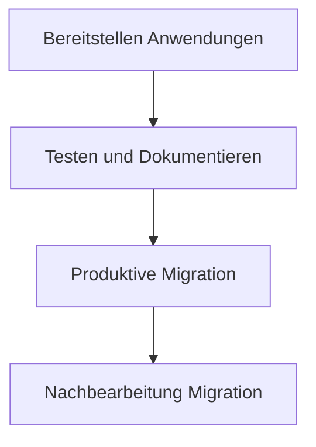

Die Abhängigkeit von Microsoft ist aktuell ein grosses Problem [^1]. Viele Unternehmen und Organisationen setzen auf die Produkte und Dienstleistungen von Microsoft, inbesondere betrifft das die Office Suite [^2]. Aufgrund dieser Abhängigkeit entstehen komplexe Fragestellungen zu Souveränität, Datenschutz und Machtstrukturen. Für Unternehmen in Europa ist Microsoft der falsche Partner. Dazu die wichtigsten Kritikpunkte:

* Die Produkte von Microsoft werden aktiv im Krieg eingesetzt [^3].
* Microsoft verhindert Alternativen und schwächt so die lokale Techbranche [^4].
* Microsoft besitzt ein Monopol und erhöht die Lizenzpreise regelmässig [^5].

Alternativen zu Microsoft Office gibt es viele und das schon lange [^6]. Grenzt man die Auswahl auf Anbieter in der Schweiz ein, landet man unweigerlich bei Infomaniak. Wir setzen bereits Produkte von Infomaniak ein und haben damit gute Erfahrungen gemacht. Hier die wichtigsten Punkte die für Infomaniak sprechen:

* Sie vertreten ethische und moralische Prinzipien [^7].
* Vereinfachung der Datenschutz-Fragen aufgrund Datenhoheit in der Schweiz. Kein Zugriff durch ausländische Behörden [^8].
* Vollumfängliche Office-Suite im Angebot [^9].

## Vorher und Nachher

Eine Migration von Microsoft auf Infomaniak ist schwieriger je nach dem wie weit die Migration in die Dienstleistungen der Office 365 Cloud vollzogen ist. Die Lizenzbündelung von Office 365 erschwert eine Trennung der einzelnen Produkte. Die folgende Grafik zeigt wie die einzelnen Produkte von Microsoft mit Produkten von Infomaniak und Open Source Software (OSS) ersetzt werden können:

| Vorher Microsoft         | Neu Infomaniak    | Neu OSS      |
| ------------------------ | ----------------- | ------------ |
| Microsoft Office         | Docs (OnlyOffice) | Libre Office |
| Outlook                  | Mail              | Thunderbird  |
| Teams                    | kChat, kMeet      |              |
| Sharepoint               | kDrive            |              |
| Office365 Mail, Kalender | Mail, Calendar    |              |
| OpenAI / ChatGPT         | AI Tools          |              |
| Mobile Apps              | kSync, Mail       |              |

## Beispiel Migration

Eine Umstellung auf Infomaniak kann in den folgenden Etappen vollzogen werden.

1\. Bereitstellen der Accounts und Anwendungen:

- Erstellen Infomaniak Accounts für Mitarbeitende
- Installation LibreOffice, kDrive, kChat und Thunderbird auf Laptops und Desktops
- Installation kSync, kDrive, kChat und Mail Apps auf Mobilgeräten
- Erstellen Dateistruktur und Zugriffsrechte analog Office 365

2\. Beginn der Testphase für Anwender und Systemintegration

- Feedback von Anwendern sammeln und verarbeiten
- Erstellen Drehbücher für Systemintegrationen
- Anpassen Nutzungskonzept (Tutorial) und Dokumentationen (Erklärungen) 

3\. Für das produktive Go-Live die Daten einmalig migrieren:

- Migration der E-Mail-Postfächer, Kontakte und Kalender nach Infomaniak
- Migration der Sharepoint-Dateien nach kDrive
- Migration der Kanal-Struktur nach kChat
- Produktive Systemintegration durchführen

4\. Nachbearbeitung Go-Live:

* Gezielte Schulungen durchführen
* Zusätzliche Ressourcen für Support bereitstellen
* Erstellen Aneitungen (HowTos) und Hilfestellungen (Referenzen)

## Open Source Software

Die Produkte von Infomaniak basieren auf Open Source Software. Mit OSS wird die Lieferantenabhängigkeit reduziert. Dazu einige Beispiele der OSS-Produkte von Infomaniak:

* kChat ist ein Fork von Mattermost: https://github.com/Infomaniak/kchat-webapp
* kSync ist ein Fork von DAVx⁵: https://github.com/Infomaniak/android-kSync
* kDrive ist ein Rewrite von Owncloud: https://github.com/Infomaniak/desktop-kDrive
* AI Tools ist inspiriert von LibreChat: https://github.com/Infomaniak/LibreChat

[^1]: https://berthub.eu/articles/posts/you-can-no-longer-base-your-government-and-society-on-us-clouds/
[^2]: https://jurgen.gaeremyn.be/2025/03/08/european-critical-dependencies/
[^3]: https://www.theverge.com/news/643670/microsoft-employee-protest-50th-annivesary-ai
[^4]: https://dnip.ch/2025/02/24/nextcloud-chef-microsoft-wollte-uns-dafuer-bezahlen-dass-wir-die-beschwerde-zurueckziehen/
[^5]: https://www.bfh.ch/de/aktuell/news/2025/stuermer-abhaengigkeit-microsoft/
[^6]: https://european-alternatives.eu/
[^7]: https://www.infomaniak.com/en/about
[^8]: https://www.infomaniak.com/de/agb/regelung-allgemeine-schutz-daten
[^9]: https://www.infomaniak.com/en/ksuite
